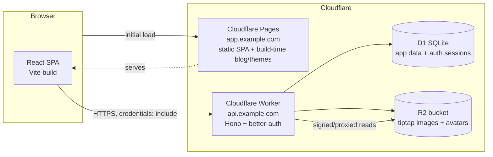

# ARCHITECTURE.md — System Design

> Status: **CANONICAL technical design.** Derived from `docs/SPEC.md` (the *what/why*). This file is the *how*.
> Decisions of record are captured as ADRs in `docs/DECISIONS.md` (ADR-002+).
> Last updated: 2026-07-02.

---

## 0. Reading guide

- SPEC = requirements (FR-*, NFR-*, OQ-*). ARCHITECTURE = design. DECISIONS = ADRs.
- This document **resolves OQ-2** (shared types placement, §5 / ADR-007) and **OQ-4** (Scale scoring math, §4 / ADR-005).
- Items still needing user confirmation are collected in §11.
- All choices favor "boring, well-supported, buildable in small tickets" per CLAUDE.md.

---

## 1. System context & deployment topology

### 1.1 High-level diagram



- **Frontend** (`frontend/`): Vite + React SPA, deployed to **Cloudflare Pages** at `app.<domain>`. Purely static output; no SSR. The blog and theme token files are compiled **at build time** into the bundle (FR-37, FR-41).
- **Backend** (`backend/`): a single **Cloudflare Worker** running **Hono**, deployed at `api.<domain>`. Exposes the JSON API and hosts **better-auth**. Binds **D1** (database + auth/session storage) and **R2** (uploads).
- **No third service.** D1 is the only database (ADR-002). R2 is the only object store (ADR-003).

### 1.2 Parent-domain strategy, CORS, and cookies (cross-origin auth)

FE and BE are **separate origins under a shared parent domain**:

- Prod: `app.example.com` (FE) + `api.example.com` (BE), parent `example.com`.
- The auth cookie is set with `Domain=.example.com` (leading dot / parent domain) so it is sent to `api.` from `app.`.
- Because it is still a **cross-origin** request (different subdomain), cookies must be `SameSite=None; Secure; HttpOnly; Path=/`.
- The Worker enables CORS with an **explicit origin allowlist** (never `*` when credentials are involved) and `Access-Control-Allow-Credentials: true`. Allowlist = the FE origin(s) for the current environment.
- The FE always calls the API with `credentials: "include"`.

This is captured in **ADR-006** (auth topology).

### 1.3 Environments

| Env | FE | BE | D1 | Cookie domain | Notes |
|---|---|---|---|---|---|
| **local** | `http://localhost:5173` (vite dev) | `http://localhost:8787` (wrangler dev / miniflare) | local miniflare D1 | host-only (`localhost`) | cross-port, still cross-origin → `SameSite=Lax` acceptable locally over http; better-auth `trustedOrigins` includes localhost |
| **preview** | Pages preview deployment URL | Worker preview (versioned) | preview D1 (separate binding) | per-preview | wired by CI per PR/ticket branch where feasible |
| **prod** | `app.example.com` | `api.example.com` | prod D1 | `.example.com` | `SameSite=None; Secure` |

- **Wrangler** config (`backend/wrangler.toml`) declares D1 and R2 bindings plus per-env `[env.preview]` / `[env.production]` sections.
- **Secrets** (`BETTER_AUTH_SECRET`, `FIRST_ADMIN_EMAIL`/`FIRST_ADMIN_PASSWORD` seed config, any signing keys) via `wrangler secret put` — never committed. FE build-time public config (API base URL) via Pages env vars / Vite `import.meta.env`.
- Local dev uses `.dev.vars` (gitignored) for Worker secrets and miniflare local D1 (`wrangler d1 migrations apply --local`).

---

## 2. Backend architecture (Hono on Workers)

### 2.1 App structure

```
backend/src/
  index.ts            # Worker entry: build Hono app, export { fetch }
  app.ts              # createApp(): mounts middleware + route groups
  env.ts              # Env/Bindings type (D1, R2, secrets) + zod-validated config
  auth/
    auth.ts           # better-auth server instance (D1 adapter, plugins)
    merge.ts          # anonymous → registered account-merge logic
    guards.ts         # requireAuth / requireRole('moderator'|'admin') middleware
  db/
    client.ts         # drizzle(d1) factory
    schema.ts         # Drizzle schema (see §3) — single source of DB truth
    seed.ts           # categories/subcategories + first-admin seed
  routes/
    auth.routes.ts        # mounts better-auth handler + /me
    questionnaires.routes.ts
    versions.routes.ts
    responses.routes.ts
    grading.routes.ts
    likes.routes.ts
    uploads.routes.ts
    categories.routes.ts
    admin.routes.ts
  services/           # business logic (grading, scale scoring, versioning, merge)
    grading.service.ts
    scale.service.ts
    versioning.service.ts
    explore.service.ts
  lib/
    error.ts          # AppError + error envelope
    sanitize.ts       # tiptap JSON sanitization/validation
    tiptap.ts         # allowed-node/mark schema for tiptap docs
    pagination.ts     # cursor encode/decode
  middleware/
    cors.ts
    error-handler.ts
    validate.ts       # zod validation helpers (json/query/param)
```

### 2.2 Middleware stack (order)

1. **CORS** (origin allowlist + credentials).
2. **Request id / logging** (structured, one line per request; `console` → Workers logs / Logpush).
3. **Auth context** — resolves the better-auth session from the request cookie and attaches `c.set('user', ...)` / `c.set('session', ...)`. Runs for all routes; does **not** reject (anonymous is valid).
4. **Route handlers**, each wrapping input in a **Zod validator** (`validate.ts` using `@hono/zod-validator`).
5. **Error handler** (`onError`) — converts thrown `AppError` / `ZodError` into the standard envelope (§6.3).

Per-route **guards** (`requireAuth`, `requireOwnerOrRole`, `requireRole`) enforce authz **server-side** (NFR-7). Client role is never trusted.

### 2.3 better-auth integration

- **Adapter:** better-auth Drizzle adapter over D1 (SQLite dialect). Auth tables (`user`, `session`, `account`, `verification`) live in the same D1 database and are generated/managed via better-auth's schema + Drizzle migrations (ADR-002, ADR-006).
- **Plugins:**
  - `anonymous` — every first-time visitor is issued a real anonymous `user` row + session (FR-1). `isAnonymous = true`.
  - `username` — registration/login by **username OR email** (FR-3); username unique + immutable (FR-4).
- **Handler mount:** the better-auth request handler is mounted under `POST|GET /api/auth/*` in `auth.routes.ts` (`auth.handler(c.req.raw)`).
- **`GET /api/me`** returns the current user (id, role, username, email, avatar, isAnonymous) for the FE to hydrate.
- **Email flows:** password reset / verification are **out of scope for MVP** (SPEC §8, OQ-3). better-auth is configured with `emailAndPassword` but **without** requiring email verification, and without a mailer, so no email delivery is needed. If a mailer becomes required, that is a new ticket + ADR. **(Confirm — §11.)**

### 2.4 Account-merge flow (anonymous → registered)

Triggered by the better-auth `anonymous` plugin's `onLinkAccount` hook (fires when an anonymous user signs up or signs in), implemented in `auth/merge.ts` (delegating DB work to `services/`):

1. Identify `anonUserId` (the pre-auth anonymous user) and `targetUserId` (the registered user).
2. In a single logical unit, **re-point ownership** from `anonUserId` to `targetUserId`:
   - `questionnaires.owner_id`
   - `responses.respondent_user_id`
   - `likes.user_id` — with **dedup**: if the target already liked a questionnaire the anon also liked, drop the anon like (keep unique `(user_id, questionnaire_id)`).
3. Delete the now-empty anonymous `user` row (and its sessions), so "no orphaned anonymous data remains referenced" (FR-2 acceptance).

> **D1 has no interactive multi-statement transactions across the Workers API**, but supports **batched statements** (`db.batch([...])`) executed atomically. The merge is expressed as a single `batch()` of UPDATE/DELETE statements. Like-dedup is done by first deleting anon likes that collide with an existing target like, then re-pointing the rest. (ADR-006.)

### 2.5 Uploads (R2)

Two endpoints, both **auth-required** (any user, incl. anonymous) with **server-side type + size validation** (NFR-4):

- `POST /api/uploads/tiptap-image` — images only (`image/png|jpeg|webp|gif`), **≤ 5 MB** (FR-12). Returns a stable URL for embedding in a tiptap doc.
- `POST /api/uploads/avatar` — images only, **≤ 10 MB** (FR-6). Returns the avatar URL; sets it on the user.

Design:
- Validate `Content-Type` **and** actual byte length (reject on mismatch or overflow; do not trust the client header alone — sniff magic bytes for the declared image type).
- Object key: `tiptap/{userId}/{uuid}.{ext}` and `avatars/{userId}/{uuid}.{ext}`.
- **Serving:** objects are read back through a Worker route `GET /api/files/:key+` that streams from R2 with the right `Content-Type` and long cache headers. This avoids a public bucket and keeps one origin for CORS. Public-read bucket + custom domain is a possible later optimization (ADR-003).
- Orphan cleanup (images uploaded but never referenced) is **out of MVP scope**; noted as future work.

### 2.6 Rich-text (tiptap JSON) sanitization

tiptap content is **stored as JSON** (not HTML) and is untrusted (author-authored, shown to answerers) → XSS surface (NFR-3):

- Define an **allowlist tiptap schema** (`lib/tiptap.ts`): permitted node types (`doc`, `paragraph`, `text`, `heading`, `bulletList`, `orderedList`, `listItem`, `image` *only for question prompts*, etc.) and permitted marks (`bold`, `italic`, `underline`, `textStyle`/`color`).
- **`sanitize.ts`** parses incoming JSON, **rejects unknown node/mark types**, strips disallowed attributes (e.g. only allow `color` to be a valid CSS color; `image.src` must be an R2 URL from our own origin), and enforces **no images** in results/outcome messages (FR-13) vs. **images allowed** in question prompts (FR-12).
- Sanitization runs **server-side before storage** and the FE renders from the sanitized JSON using tiptap's read-only renderer (defense in depth — sanitize again on render). We never `dangerouslySetInnerHTML` raw stored HTML.
- Character-count is enforced as a max serialized/text length server-side too.

---

## 3. Data model — D1 schema (Drizzle)

Conventions (D1/SQLite specifics — see `d1-drizzle-schema` skill and ADR-002):
- **Foreign keys are always enforced** in D1.
- No native `boolean`/`datetime`/`json`: booleans → `integer` with `{ mode: 'boolean' }`; timestamps → `integer` (unix ms) with `{ mode: 'timestamp_ms' }`; JSON → `text` with Drizzle `{ mode: 'json' }` and a typed generic.
- IDs: `text` primary keys holding **UUIDv7-ish** sortable ids (created app-side) — sortable, index-friendly, no auto-increment coupling. better-auth tables use better-auth's own id format.
- Ordering: **fractional index** strings (`text`, e.g. "a0", "a1", "a0V") for `position`, so drag-reorder inserts between neighbors without renumbering (FR-9). See §3.10.
- **100 bound-parameter limit** per D1 statement — batch large inserts (version snapshots) carefully.

### 3.1 Auth tables (better-auth managed)

`user`, `session`, `account`, `verification` — schema generated by better-auth's Drizzle schema. Notable app additions on `user`:

| column | type | notes |
|---|---|---|
| `id` | text PK | better-auth id |
| `name` | text | |
| `username` | text unique nullable | from `username` plugin; **immutable** (FR-4); null for pure-anon |
| `email` | text unique nullable | nullable for anon |
| `role` | text | `'user' \| 'moderator' \| 'admin'`, default `'user'` (FR-7) |
| `is_anonymous` | integer(boolean) | from `anonymous` plugin (FR-1) |
| `avatar_url` | text nullable | R2 URL (FR-6) |
| `created_at`/`updated_at` | integer(ts) | |

Index: `username`, `email` (unique). `role` (for admin listing).

### 3.2 questionnaires (mutable "head" record)

The **editable head** of a questionnaire — its identity, ownership, current draft state, and the pointer to the latest published version.

| column | type | notes |
|---|---|---|
| `id` | text PK | |
| `owner_id` | text FK→user.id | (FR-1/FR-2 merge re-points this) |
| `type` | text | `'quiz' \| 'survey' \| 'scale'` (FR-8) |
| `title` | text | |
| `description` | text(json) | tiptap JSON (no images) |
| `visibility` | text | `'public' \| 'private'` (FR-18) |
| `status` | text | `'draft' \| 'published'` |
| `private_link_token` | text unique nullable | unguessable token for `/[private-link]` (NFR-7) |
| `current_version_id` | text FK→questionnaire_versions.id nullable | latest published version |
| `draft_snapshot` | text(json) nullable | the in-progress edit (unpublished) content, same shape as a version snapshot |
| `like_count` | integer default 0 | denormalized (FR-30) |
| `category_id` | text FK→categories.id nullable | |
| `subcategory_id` | text FK→subcategories.id nullable | |
| `created_at`/`updated_at` | integer(ts) | |

Indexes: `owner_id`; `(status, visibility)` for Explore; `like_count` (Explore ranking); `category_id`; `private_link_token` unique.

### 3.3 questionnaire_versions (immutable snapshots) — **full-JSON snapshot strategy (recommended)**

**Decision (ADR-004): store each published version as ONE immutable full-JSON snapshot row**, not as normalized versioned child rows.

| column | type | notes |
|---|---|---|
| `id` | text PK | |
| `questionnaire_id` | text FK→questionnaires.id | |
| `version_number` | integer | monotonic per questionnaire (1,2,3…) |
| `type` | text | copy of type at publish time |
| `snapshot` | text(json) | **the entire authored content**: sections, questions (+options, correctness, acceptable answers, caseSensitive, isOptional, position), behavior flags, results/outcome messages, and (for scale) dimensions + per-option weights + outcome mapping |
| `published_at` | integer(ts) | |
| `created_by` | text FK→user.id | |

Unique: `(questionnaire_id, version_number)`. Index: `questionnaire_id`.

**Why full-JSON over normalized versioned rows** (ADR-004 rationale):
- **Immutability is trivial and guaranteed** — a snapshot is a single frozen document; nothing can accidentally mutate a child row of an old version.
- **Reads are one row** — answering/rendering a version needs no multi-join reconstruction; the FE reads the same shape it authored.
- **D1-friendly** — avoids N inserts (and the 100-param limit) per publish; one row write. Versioned-normalized would multiply rows across sections/questions/options for every republish.
- **The authored content is a document, not a relational query target.** We never need to query "all questions of type X across versions"; we always fetch a whole questionnaire version. Snapshots are the natural fit.
- **Trade-off accepted:** the snapshot JSON is validated by a **Zod schema** (shared, §5) on write, so the "schema" of a version lives in code, not in table columns. Analytics that need to slice inside snapshots would require JSON extraction — acceptable given MVP has no such requirement.

The **typed snapshot shape** (`QuestionnaireSnapshot`) is a shared Zod schema (§5). It is the contract for authoring, versioning, answering, and grading.

> **Note on entities in SPEC §5** (Section, Question, ScaleDimension, ScaleOutcome, options): these are **modeled as nested objects inside the snapshot JSON**, not as their own tables. This directly implements FR-25/26/27 (immutable versions, version-bound responses) with the least machinery. Answers still reference questions **by the question id embedded in the snapshot** (stable within a version).

### 3.4 responses

| column | type | notes |
|---|---|---|
| `id` | text PK | |
| `questionnaire_id` | text FK→questionnaires.id | |
| `version_id` | text FK→questionnaire_versions.id | **version-bound** (FR-27) |
| `respondent_user_id` | text FK→user.id | anon or registered (merge re-points) |
| `submitted_at` | integer(ts) | |
| `grading_status` | text | `'na' \| 'pending' \| 'graded'` (FR-21) |
| `score` | text(json) nullable | computed result: quiz → {correct, total, pending?}; scale → {dimensionScores, outcomeKey}; survey → null/na |
| `created_at` | integer(ts) | |

Indexes: `questionnaire_id`, `version_id`, `respondent_user_id`. Re-submission → multiple rows (FR-28), no uniqueness constraint on respondent+questionnaire.

### 3.5 answers

| column | type | notes |
|---|---|---|
| `id` | text PK | |
| `response_id` | text FK→responses.id | |
| `question_id` | text | the question id **from the snapshot** (not a FK to a table) |
| `value` | text(json) | selection(s) for Single/Multiple (option ids), text for Short/Long |
| `auto_grade` | text nullable | `'correct' \| 'incorrect' \| null` for auto-graded types |
| `manual_grade` | text(json) nullable | for Long: `{ awarded: boolean, gradedAt, gradedBy }` (FR-22) |

Index: `response_id`. **Manual-grading state (FR-21):** a response is `pending` while any Long answer's `manual_grade` is null; it becomes `graded` when all Long answers are graded (`grading.service` recomputes `responses.grading_status` + finalizes `responses.score`); `na` for surveys/scales.

### 3.6 categories / subcategories (seeded, fixed — FR-34)

- `categories`: `id` PK, `name`, `slug` unique, `position`.
- `subcategories`: `id` PK, `category_id` FK, `name`, `slug`, `position`.
- No create/update endpoints; populated by `seed.ts` (SPEC §8 out-of-scope for user creation).

### 3.7 likes (FR-33)

| column | type | notes |
|---|---|---|
| `user_id` | text FK→user.id | |
| `questionnaire_id` | text FK→questionnaires.id | |
| `created_at` | integer(ts) | |

**Composite PK / unique `(user_id, questionnaire_id)`** → dedup by user id (works for anon + registered). Toggling a like updates the denormalized `questionnaires.like_count` in the **same `db.batch`** as the insert/delete (§3.9). Index: `questionnaire_id`.

### 3.8 scale dimensions & outcomes — location

Per ADR-004, dimensions, per-option weights, and outcome mapping are **inside the version snapshot JSON** (immutable per version). They are **not** separate D1 tables. This keeps the scoring config version-bound automatically (a response scored against the version it answered). The shared `QuestionnaireSnapshot` Zod schema defines their shape (§4.2, §5).

### 3.9 Denormalized `like_count` integrity

Because D1 lacks the triggers we would otherwise lean on, `like_count` is maintained **only** through the likes service, always as an atomic `db.batch`:
- Like: attempt `INSERT` into likes; if a row was actually inserted (`changes > 0`), increment `like_count`.
- Unlike: delete; if a row was removed, decrement.
- Merge dedup (§2.4): anon likes that collide with a target like are **deleted without decrementing** the target's count; non-colliding anon likes are re-pointed **without incrementing** (the count already reflected the anon like). An optional reconciliation job could recompute counts, but is out of MVP scope.

### 3.10 Ordering & versioning summary

- **Ordering within a draft/snapshot:** each section/question carries a **fractional-index `position` string**. Drag-reorder computes a new key between neighbors → no bulk renumber, no 100-param batch. On publish, positions are frozen into the snapshot.
- **Versioning:** publish = validate `draft_snapshot` → insert new `questionnaire_versions` row with `version_number = max+1` → set `questionnaires.current_version_id`. Editing a published questionnaire writes to `draft_snapshot`; the next publish makes another version. Old versions and their responses are untouched (FR-25/26/27).

---

## 4. Scale scoring model — **resolves OQ-4** (ADR-005)

MBTI-style, multi-dimensional, fully author-defined, deterministic.

### 4.1 Model

1. **Dimensions.** The author defines N named dimensions, each with a stable `key` (e.g. `EI`, `SN`) and display name. A dimension is an **axis**; it may be *bipolar* (two poles, e.g. E vs I) or *unipolar* (a single accumulating score). We model both with **poles**:
   - A dimension has one or more **poles**, each with a `key` (e.g. `E`, `I`). A unipolar dimension has a single pole.
2. **Per-option weight vectors.** Every answer **option** (on Single/Multiple questions) carries a `weights` map: `{ [poleKey]: number }`. Selecting the option adds those weights to the running pole totals. Options may weight multiple poles/dimensions (FR-24). Unselected/absent poles contribute 0.
3. **Aggregation.** Response pole scores = sum of weights across all selected options. For **Multiple** questions, each selected option contributes; for **Single**, exactly one option contributes.
4. **Per-dimension resolution (winner-take-all by default).** For each dimension, the **winning pole** = the pole with the highest total (ties broken by an author-set `tieBreak`, else pole declaration order). This yields a **result key** = ordered concatenation of winning pole keys, e.g. `E`+`S`+`T`+`J` → `"ESTJ"`.
5. **Outcome mapping.** The author defines **outcomes**, each keyed by a **result key** (winner-take-all: exact pole-combo key) **or** by **threshold bands** on a specific dimension's normalized score. Default and recommended path is **winner-take-all → exact result-key lookup**, with an optional **bands** mode per dimension for questionnaires that want "0–33 = low / 34–66 = mid / 67–100 = high" single-axis outcomes.
   - Each outcome has: `key`, tiptap `message` (no images), and an **optional** per-outcome results screen content.
   - A required **fallback/default outcome** guarantees every completion maps to something.

### 4.2 Snapshot shape (Zod, shared)

```ts
// inside QuestionnaireSnapshot when type === 'scale'
scale: {
  dimensions: Array<{
    key: string;              // "EI"
    name: string;
    poles: Array<{ key: string; name: string }>;  // [{key:'E'}, {key:'I'}]
    tieBreak?: string;        // pole key preferred on tie
  }>;
  // options everywhere carry: weights?: Record<string /*poleKey*/, number>
  scoring: {
    mode: 'winner-take-all' | 'bands';
    bands?: Array<{           // only when mode === 'bands'
      dimensionKey: string;
      min: number; max: number;  // on normalized 0..100
      outcomeKey: string;
    }>;
  };
  outcomes: Array<{
    key: string;              // "ESTJ" (winner-take-all) or a band outcomeKey
    message: TiptapDoc;       // no images
    resultsScreen?: TiptapDoc;
    isDefault?: boolean;      // fallback
  }>;
}
```

### 4.3 Determinism & storage

Scoring runs **server-side** in `scale.service.ts` at response submit, producing `responses.score = { dimensionScores, winningPoles, outcomeKey }`. Because dimensions/weights/outcomes live in the immutable snapshot, re-scoring an old response is reproducible. Unit-tested (Vitest) with fixtures per mode (NFR-10).

---

## 5. Shared types & Zod strategy — **resolves OQ-2** (ADR-007)

**Decision: a `shared/` workspace package (`@app/shared`) at the repo root**, imported by both `frontend/` and `backend/`.

- CLAUDE.md says FE code lives in `frontend/`, BE in `backend/`. `shared/` is **neither app's code** — it is a third workspace holding only **types and Zod schemas** (no runtime app logic, no FE/BE-specific deps). This satisfies the separation rule while giving one source of truth (ADR-007).
- Contents: Zod schemas + inferred TS types for **API request/response bodies**, the **`QuestionnaireSnapshot`** contract, the **error envelope**, enums (roles, types, question types, visibility, grading status), and pagination cursors.
- **Single source of validation:** the backend validates inbound requests with these Zod schemas; the frontend uses the same schemas for form validation (Tanstack Form + Zod) and to type API responses. No code generation, no drift.
- Wired via a **root workspace** (`package.json` `workspaces: ["frontend","backend","shared"]` or pnpm workspace). `@app/shared` is a dependency of both. It ships TS source (consumed by Vite/Wrangler bundlers directly) — no separate build step required for MVP.
- Drizzle table types stay **backend-only** (`backend/src/db/schema.ts`); we do not leak DB row types across the boundary — the API contract types in `shared/` are the boundary.

```
shared/
  package.json        # name: "@app/shared", type: module, exports src
  src/
    index.ts
    enums.ts          # Role, QuestionnaireType, QuestionType, Visibility, GradingStatus
    tiptap.ts         # TiptapDoc zod (allowlist mirror of backend sanitizer input)
    snapshot.ts       # QuestionnaireSnapshot (sections/questions/options/scale)
    api/
      auth.ts
      questionnaires.ts
      responses.ts
      likes.ts
      uploads.ts
      categories.ts
      admin.ts
      common.ts       # error envelope, pagination cursor, id types
```

---

## 6. API contract approach

### 6.1 Style — REST resource routes with Zod-validated bodies (ADR-009)

- **REST over RPC.** Plain HTTP resource routes (`/api/questionnaires`, `/api/responses`, …) using Hono routers. Rationale: boring, cache/proxy-friendly, easy to test with `npx hono request` and Playwright, and the FE uses **Tanstack Query** which maps cleanly to REST endpoints. We do **not** adopt Hono RPC/`hc` client for MVP, to keep the contract explicit and framework-agnostic; shared Zod types give type-safety without RPC coupling.
- **Validation:** every endpoint validates params/query/body via `@hono/zod-validator` using schemas from `@app/shared`. Same schemas power FE forms.

### 6.2 Auth guards per role

- `requireAuth` — must have a session (anonymous counts as authed). Used by create/answer/like/upload.
- `requireOwnerOrRole(roles)` — owner of the resource **or** one of the roles. Edit-own uses owner; delete-any uses `['moderator','admin']`.
- `requireRole('admin')` — admin dashboard + user administration; moderators get view/delete-any but **not** edit-others (enforced by separate guards on edit vs delete/read routes per §2.2 matrix).
- All enforced server-side; the FE hides UI it can't use but never gates security (NFR-7).

### 6.3 Error envelope (shared)

```json
{ "error": { "code": "VALIDATION_ERROR", "message": "human readable", "details": { "field": "..." } } }
```

- Codes: `VALIDATION_ERROR` (422), `UNAUTHORIZED` (401), `FORBIDDEN` (403), `NOT_FOUND` (404), `CONFLICT` (409, e.g. duplicate username), `PAYLOAD_TOO_LARGE` (413, uploads), `INTERNAL` (500). Defined in `shared/src/api/common.ts` and produced by `backend/src/lib/error.ts`.

### 6.4 Endpoint groups (not full OpenAPI)

| Group | Representative endpoints | Guard |
|---|---|---|
| **auth** | `ALL /api/auth/*` (better-auth), `GET /api/me` | public / self |
| **questionnaires** | `GET /api/questionnaires` (Explore: category filter, cursor 20), `POST /api/questionnaires`, `GET /api/questionnaires/:id`, `PATCH /api/questionnaires/:id` (draft edit), `DELETE /api/questionnaires/:id`, `GET /api/q/link/:token` (private) | mixed: create=auth, edit=owner, delete=owner-or-mod/admin |
| **versions** | `POST /api/questionnaires/:id/publish` (snapshot new version), `GET /api/questionnaires/:id/versions`, `GET /api/versions/:versionId` | owner / read per visibility |
| **responses** | `POST /api/questionnaires/:id/responses` (answer against current version), `GET /api/responses/:id`, `GET /api/questionnaires/:id/responses` (owner) | auth; owner for listing |
| **grading** | `GET /api/questionnaires/:id/grading` (pending Long answers), `POST /api/responses/:id/grade` | owner-or-admin |
| **likes** | `POST /api/questionnaires/:id/like`, `DELETE /api/questionnaires/:id/like` | auth |
| **uploads** | `POST /api/uploads/tiptap-image`, `POST /api/uploads/avatar`, `GET /api/files/:key+` | auth (read: per resource) |
| **categories** | `GET /api/categories` (with subcategories) | public |
| **profiles** | `GET /api/users/:username` (published + liked) | public |
| **settings** | `PATCH /api/me` (password/email/avatar) | self |
| **admin** | `GET /api/admin/users`, `POST /api/admin/users` (create mod/admin), `PATCH /api/admin/users/:id`, admin content actions | admin |

---

## 7. Frontend architecture (Vite + React on Pages)

### 7.1 Routing — Tanstack Router (proposes OQ-1 naming; confirm §11)

File-based route tree matching SPEC §4:

```
/                       index (landing)
/explore                Explore (category filter, cursor pagination)
/q/new                  create Quiz
/s/new                  create Survey
/scale/new              create Scale        (OQ-1: proposed naming)
/q/$id                  view / answer a questionnaire (resolves to answer or view by role)
/q/$id/edit             builder (owner/admin)
/q/$id/grade            manual grading UI (owner/admin)
/l/$token               private-link access ( /[private-link] )
/user/$username         public profile (published + liked)
/settings               profile settings (registered)
/blog                   blog index (build-time md)
/blog/$slug             blog post (build-time md)
/admin                  admin dashboard (admin)
/design-system          component/token gallery (dev/design aid)
/auth/sign-in           sign in (username or email)
/auth/sign-up           sign up
```

- Route **loaders + Tanstack Query** for data (loaders prime the query cache). Role/visibility guards in `beforeLoad` (calling `/api/me`); private link route is token-gated.
- `/q/$id` decides answer-vs-view based on ownership/role fetched in the loader.

### 7.2 Layout & sidebar

- Root layout: **collapsible left sidebar** + **top-right header** (theme switch + custom-theme dropdown, FR-39; account menu).
- Sidebar is **hidden** on **sign-in/sign-up** and during **quiz-answering** — implemented as **layout routes**: an `AppLayout` (with sidebar) wrapping most routes, and a `BareLayout` (no sidebar) wrapping `/auth/*` and the answering view.
- Sidebar collapsed/expanded state persisted in **Zustand** (UI store) + localStorage.

### 7.3 State management

- **Server state → Tanstack Query.** All API data (questionnaires, explore feed, responses, me). Query keys mirror endpoint groups; cursor pagination via `useInfiniteQuery` for Explore.
- **Client/UI state → Zustand** stores:
  - `themeStore` — active theme key, persisted (FR-37/38/39).
  - `uiStore` — sidebar collapsed, modals.
  - `quizTakingStore` — current question index, answers-in-progress, one-at-a-time/paginated/fixed-answer navigation state, progress (FR-14/15/16); progress-bar color reads the active theme token (FR-19).
  - `builderStore` — the in-progress questionnaire **draft** (sections, questions, options, positions, behavior flags), enabling **client-side Preview through to results before saving** (FR-29).
- **Forms → Tanstack Form + Zod** (schemas from `@app/shared`) for auth, settings, and the builder fields.

### 7.4 UI, theming, editor, content pipelines

- **Shadcn/ui + Tailwind**, base font **Inter** (FR-40).
- **Theming:** shadcn-style **CSS custom-property token files** committed under `frontend/src/themes/*.css` (FR-37). At **build time** they are bundled; runtime switch toggles a `data-theme`/class on `<html>` and the `themeStore` records the choice. Adding a theme = adding a token file + registering it in a manifest. Light (default) + dark shipped (FR-38). Progress bar and all component colors derive from tokens (FR-19). (ADR-010.)
- **tiptap editor:** shared editor component with the SPEC extensions — **character-count**, **filehandler** (image upload → `POST /api/uploads/tiptap-image`, 5 MB), **color**; a **no-image** variant for results/outcome messages (FR-13). Read-only renderer for answerers, fed the sanitized JSON.
- **Blog pipeline (build-time):** `.md` files under `frontend/src/content/blog/*.md`; a Vite plugin (frontmatter + markdown loader) parses and renders at build time into route data for `/blog` and `/blog/$slug` (FR-41/42). No DB, no CRUD (SPEC §8). (ADR-008.)
- **Design system route** (`/design-system`) renders the token palette + component gallery across themes for visual QA.

---

## 8. Folder structure

### 8.1 Repo root

```
/
  package.json          # workspaces: frontend, backend, shared
  docs/                 # SPEC, ARCHITECTURE, DECISIONS, tickets, CONTEXT
  shared/               # @app/shared (types + zod) — see §5
  frontend/
  backend/
```

### 8.2 frontend/

```
frontend/
  index.html
  vite.config.ts
  tailwind.config.ts
  package.json
  src/
    main.tsx
    router.tsx            # Tanstack Router tree
    routes/               # file-based routes mirroring §7.1
      __root.tsx
      _app/               # AppLayout (sidebar) group
      _bare/              # BareLayout (auth, answering) group
      ...
    components/
      ui/                 # shadcn components
      editor/             # tiptap editor + readonly renderer
      builder/            # questionnaire builder pieces (sections, questions, options, dnd)
      explore/
      layout/             # sidebar, header, theme-switch
    stores/               # zustand: theme, ui, quizTaking, builder
    lib/
      api.ts              # fetch wrapper (credentials: include, error envelope parse)
      queries/            # tanstack query hooks per endpoint group
    themes/               # *.css token files + manifest.ts
    content/blog/         # *.md posts (build-time)
    test/                 # vitest + playwright helpers
  e2e/                    # Playwright specs
```

### 8.3 backend/

```
backend/
  wrangler.toml
  package.json
  drizzle.config.ts
  migrations/             # drizzle-generated SQL for D1
  src/                    # see §2.1
  test/                   # vitest unit + route tests
```

### 8.4 shared/ — see §5.

---

## 9. Cross-cutting concerns

### 9.1 Validation
- **All API inputs** validated with Zod (`@app/shared` schemas) via `@hono/zod-validator` (NFR-2). Same schemas reused on the FE for form validation → no drift.

### 9.2 Sanitization / XSS (NFR-3)
- tiptap JSON sanitized server-side against an allowlist schema **before storage** and rendered from sanitized JSON via tiptap's read-only renderer (no raw HTML injection). Image nodes restricted to our own R2 URLs; `color` restricted to valid CSS colors; images forbidden in results/outcome docs.

### 9.3 Authz enforcement points (NFR-7)
- Server-side guards on every mutating/reading-sensitive route (§6.2). Role read from the DB-backed session, never from the client. Private-link tokens are unguessable (crypto-random) and grant read access only to that questionnaire's shared version.

### 9.4 Error handling
- Central Hono `onError` → shared error envelope (§6.3). No stack traces leaked in prod. Uploads over limit → 413. Duplicate username/email → 409.

### 9.5 Logging
- Structured one-line-per-request logs to Workers logs (request id, method, path, status, user id, duration). Errors logged with code. Logpush optional in prod.

### 9.6 Testing strategy (NFR-10)
- **Vitest** — backend unit (grading, scale scoring, versioning, merge, sanitizer) and route tests (Hono app with a test D1 via `@cloudflare/vitest-pool-workers` / miniflare). Shared Zod schemas unit-tested for the snapshot contract.
- **Playwright** — E2E for critical journeys: anonymous create → answer → like; sign-up merge; quiz grading pending→graded; scale outcome; Explore filter/pagination; private-link access.
- **E2E seeded D1 + auth:** Playwright runs against a `wrangler dev` (local miniflare D1) + Pages dev server. A **global setup** applies migrations and runs `seed.ts` (categories + a first-admin) against the local D1; auth is exercised through real better-auth endpoints (anonymous session issued automatically; a seeded admin login for admin flows). Each spec resets/reseeds relevant tables for isolation.
- Every logic-bearing ticket adds/updates tests (CLAUDE.md, NFR-10).

---

## 10. Build-in-small-tickets ordering (guidance for ai-team-producer)

Rough dependency order (each a small ticket): repo workspaces + `shared` scaffold → backend init (Hono + Wrangler + D1 binding) → Drizzle schema + first migration + seed → better-auth (anonymous + username) + `/me` → merge flow → uploads + sanitizer → questionnaire CRUD + draft → publish/versioning → responses + auto-grade → manual grading → scale scoring → likes + explore → categories/profiles → admin → FE init (Vite + Router + Query + Tailwind/shadcn + themes) → layouts/sidebar → auth screens → builder → answering + preview → explore UI → profiles/settings → blog pipeline → admin UI → E2E.

---

## 11. Decisions needing user confirmation

These are `ASSUMPTION:`/`CLARIFIED:`-tagged in SPEC or introduced here; flagged before build:

1. **Route naming (OQ-1):** `/scale/new`, `/q/$id/edit`, `/q/$id/grade`, `/l/$token` for private links, `/auth/sign-in|sign-up`. Confirm the private-link path shape and edit/grade nesting.
2. **Email flows (OQ-3):** MVP ships **no** password-reset/verification and **no mailer**. If password reset is required, it becomes a ticket + ADR (needs an email provider — see `cloudflare-email-service`). Confirm out-of-scope is acceptable.
3. **Anonymous content TTL (OQ-5):** no cleanup/TTL for never-merged anonymous content in MVP. Confirm acceptable, or specify a retention policy.
4. **File serving:** proxied via Worker (`GET /api/files/:key+`) rather than a public R2 bucket, to keep one CORS origin and avoid public buckets. Confirm (public bucket + CDN is a later perf option).
5. **Scale scoring default (OQ-4 / ADR-005):** winner-take-all per dimension → exact result-key outcome lookup, with an optional per-dimension "bands" mode and a required default outcome. Confirm this matches the intended MBTI-style behavior.
6. **Shared package (OQ-2 / ADR-007):** a root `shared/` workspace holding types + Zod (not duplicated per side, no codegen). Confirm this is an acceptable reading of the "FE in frontend/, BE in backend/" rule.
7. **Domain names:** `app.` / `api.` under one registrable parent domain with parent-domain cookies. Confirm the actual domain when provisioning.
